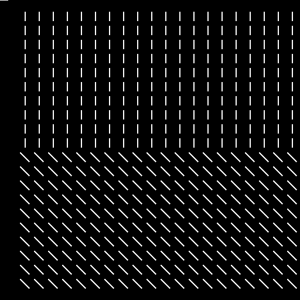
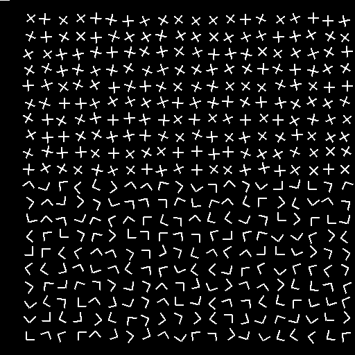

# Texture-segmentation
## Gabor filter :
Gabor filter is a linear filter used for texture analysis i.e. basically analyzes whether there are any specific frequency content in the image in specific directions in a localized region around the point or region of analysis. 

## Implementation:
Gabor filter is implemented for different images with different frequencies of interest and standard deviation. Once the image is filtered, it is thresholded by applying a smoothing filter and thus the textures are segmented. 

The project report can be found under Gurudath_Li_Project4_report.pdf which would detail the entire project. 

A brief representation of the input, 3D analysis and output are as follows:
### Input

### 3-D Visualization

### Segmented output image

